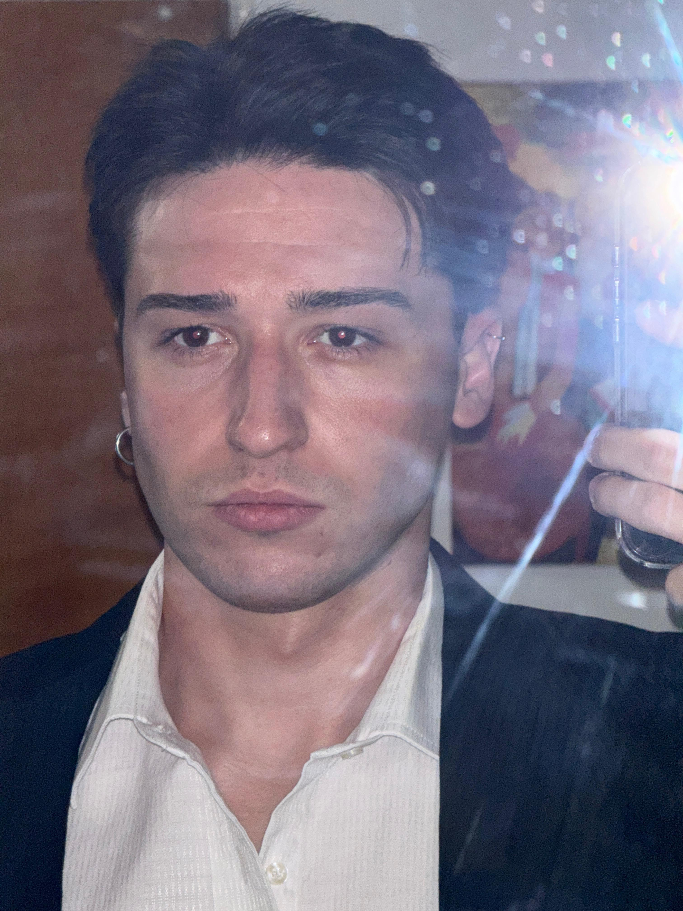

## **Trabajo Practico n°0**

- **Nombre**: Alejo Gomez
- **Legajo**: 213.3777-5

  

  Tengo 25 años y soy de Lomas de Zamora. Comence estudiando Ingenieria Electronica, pero despues de un tiempo me di cuenta de que no era lo que queria para mi futuro, asi que decidi cambiarme a Sistemas. Actualmente, llevo mas de un año trabajando como desarrollador para el Banco de Santa Fe. Mientras avanzaba en la carrera, realice algunos bootcamps para complementar mi formacion, entre ellos uno de Java que fue el que mas me gusto. Soy una persona inquieta, siempre en busca de nuevos desafios, y por eso estoy entusiasmado por descubrir como sera esta materia.
